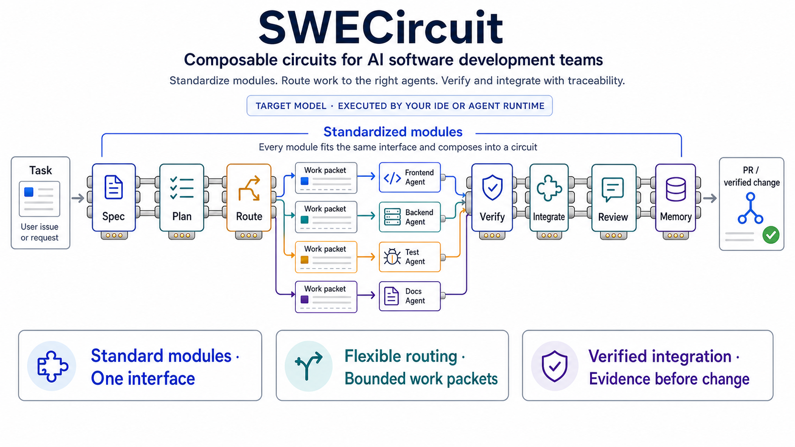

# SWECircuit

[](https://github.com/GarrettAudet/SWECircuit/actions/workflows/template-check.yml)

**Composable workflows for traceable AI software engineering.**

SWECircuit gives AI software teams a standard way to compose development workflows from reusable modules, split goals into bounded work packets, route those packets to external agents, verify evidence, and preserve the execution trace.

The diagram shows the target operating model. The V10 kernel can now validate and execute one host-selected work packet through a caller-injected executor and return a caller-owned event journal. External hosts still select and schedule work, enforce permissions, isolate runtimes, persist traces, and merge changes.

That host-owned selection is a V10 limitation, not the final orchestration model. V11 is designing a built-in, provider-independent **Specialist Compiler**: it compares a serial baseline with legal decomposition candidates, rejects vague role-only agents, and compiles every bounded packet into exact supply-free task demand. Each AgentBlueprint fixes the deliverable, artifact ports, justified context, least authority, evidence, handoff, and stop conditions. Assignment later binds compatible runtime capacity, while a prompt-free receipt records what the host materialized. IDE, model, and provider adapters cannot redefine the workflow contract.

```txt
user goal -> approved modules -> candidate teams -> Specialist Compiler -> task-shaped AgentBlueprints -> runtime assignments -> verified change
```



## How It Works

```txt
module -> circuit -> work packet -> host-injected executor -> evidence gate -> verified integration -> caller-owned trace + project memory
```

1. **Define modules.** Give each stage an input, action, output, gate, and outcome.
2. **Compose a circuit.** Connect the modules needed for a feature, fix, review, or release.
3. **Decompose the goal.** Create bounded work packets with scope, dependencies, verification, and stop conditions.
4. **Execute and integrate.** A trusted IDE or runtime injects the executor for one packet; SWECircuit checks its grant and returns lifecycle evidence to the integration owner.
5. **Verify and learn.** Gates control integration; the trace records what happened, and durable lessons enter project memory.

SWECircuit defines and checks the workflow contract and bounds one injected execution. It is not an agent scheduler, model runtime, permission sandbox, or merge engine.

The next orchestration layer will add portable planning and assignment above that bounded executor while keeping provider calls, workspace isolation, credentials, and other side effects behind adapters.

## Core Contracts

| Contract | Purpose |
| --- | --- |
| Module | Reusable work stage with a standard input, action, output, gate, and outcome. |
| Circuit | Ordered or branched composition of modules. |
| Work packet | Bounded unit of work with ownership, context, dependencies, evidence, and stop conditions. |
| Specialist Compiler | Built-in semantic design plus pure `compileAgentBlueprints` validation for exact task-shaped agent demand. |
| Gate | Decision point that passes, fixes, diagnoses, clarifies, redesigns, splits, blocks, or learns. |
| Execution trace | Caller-owned event record connecting work, attempts, outcomes, and evidence. |
| Memory | Durable project knowledge promoted from completed work. |

## Start Here

Requires Node.js 22.14 or newer. From a source checkout, run:

```powershell
npm ci
npm run build
node dist/cli.js validate --project examples/minimal
node dist/cli.js inspect --project examples/minimal --trace traces/example.jsonl
```

The final two commands print:

```txt
Validated example-project (0 artifacts).
Inspected traces/example.jsonl (2 events, 1 runs).
```

Initialize an existing empty directory with:

```powershell
node dist/cli.js init --project <existing-empty-directory> --project-id quick-start
```

Initialization is one-time and never overwrites its owned files. Validation and inspection are read-only; `--trace` is relative to the explicit project root.

These are repository-local development commands for the private workspace; SWECircuit does not publish a package binary or public CLI.

Library hosts can execute one validated packet through the [bounded executor boundary](docs/framework/executor-boundary.md). The host supplies trusted executable code and retains responsibility for isolation, approvals, persistence, and integration.

For the full operating protocol, start with [AGENTS.md](AGENTS.md) and the [handbook](docs/ai/handbook.md).

## Repository Guide

| Path | Purpose |
| --- | --- |
| [`examples/minimal/`](examples/minimal/) | Small valid project and caller-owned trace used by the quick start. |
| [`docs/framework/`](docs/framework/) | Circuit composition, decomposition, orchestration, and adapter contracts. |
| [`docs/specs/`](docs/specs/) | Traceable feature work packages and implementation evidence. |
| [`docs/memory/`](docs/memory/) | Decisions, history, known issues, patterns, and retrieval pointers. |
| [`docs/modules/`](docs/modules/) | Reusable module contracts. |
| [`docs/packs/`](docs/packs/) | Optional first-party and community extensions. |

## Principles

- Simple surface, explicit contracts.
- Clarify before ambiguous work.
- Decompose before parallelizing.
- Diagnose before repeated fixes.
- Verify before integration.
- Preserve evidence, then update memory.

## Status

**Implemented now:** initialize one explicit project, validate canonical v1alpha1 artifacts offline, inspect caller-owned JSONL traces, and execute exactly one validated work packet through a trusted caller-injected executor with a checked invocation grant and frozen lifecycle journal.

**Defined as workflow contracts:** specification, decomposition, bounded parallel work, gates, integration review, durable memory, modules, circuits, packs, and adapters.

**Left to external hosts:** provider calls, packet selection and scheduling, permission enforcement, workspace isolation, durable trace writing, evidence retrieval, retries, branch integration, and memory mutation. The V10 kernel does not dynamically load adapters, execute circuits, terminate process trees, merge branches, or update memory automatically.

**Target orchestration layer:** SWECircuit owns provider-independent decomposition, capability matching, dependency-aware parallel scheduling, fan-in, verification, integration policy, and trace semantics. Hosts remain replaceable execution adapters for IDE- and provider-specific side effects.

See [Contributing](CONTRIBUTING.md), [Security](SECURITY.md), [Support](SUPPORT.md), and the [Changelog](CHANGELOG.md).
