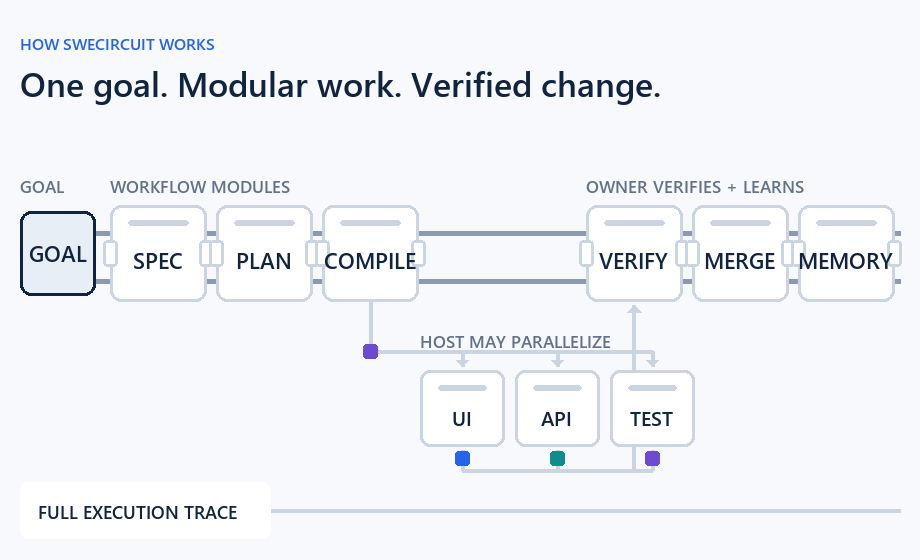

# IDECircuit

[](https://github.com/GarrettAudet/SWECircuit/actions/workflows/template-check.yml)

**The orchestration layer for agentic IDEs.**

IDECircuit turns one software goal into reviewed work units, task-specific specialist contracts, dependency-safe parallel work, verified integration, and a durable execution trace.

A developer or IDE closes the goal and decomposes it into atomic work units. IDECircuit validates reviewed work units, compares legal specialist teams with a serial baseline, and emits exact contracts. An external IDE host supplies the runtime and may execute dependency-safe contracts in parallel.



## How It Works

1. **Define:** the developer and IDE close product intent, acceptance criteria, modules, evidence, authority, dependencies, and stop conditions.
2. **Compile:** IDECircuit checks the work graph, compares legal specialist teams with a serial baseline, and emits exact task-specific contracts.
3. **Dispatch:** An external IDE host selects providers, models, effort, skills, and tools, then may run dependency-safe contracts in parallel.
4. **Verify:** IDECircuit checks approval-bound packages, exact handoffs, outcomes, and dependency fan-in before integration.
5. **Integrate and learn:** one owner tests and merges the assembled change, preserves the execution trace, and promotes durable lessons into memory.

IDECircuit Core compiles specialist contracts and verifies approval-bound packages, raw handoffs, dependency fan-in, and immutable run sessions.
An external IDE host dispatches agents, enforces permissions, executes tools, integrates and merges changes, persists traces, and updates memory.

## Start Here

Requires Node.js 22.14 or newer.

```powershell
npm ci
npm run build
node dist/cli.js validate --project examples/minimal
node dist/cli.js inspect --project examples/minimal --trace traces/example.jsonl
npm run example:specialist
```

The CLI commands validate and inspect the minimal project. The specialist example compiles and verifies a two-specialist package in memory. It writes no files and launches no agents. See its [source](examples/specialist-compiler/) and the [IDE kickoff](docs/ide/specialist-agent-kickoff.md).

Maintainers run `npm run verify` for the complete repository gate.

## Status

V11 is the stable baseline. It compiles deterministic, approval-bound specialist packages and verifies raw handoffs without executing agents. See the [V11 milestone](docs/milestones/v11.md) and [compiler contract](docs/specs/v11-specialist-compiler/specialist-compiler-contract.md).

V12 is in release review. It adds a portable, immutable run session that exposes dependency-eligible work, accepts exact verified handoffs, survives restart, and reports when integration may begin. It still performs no host effects. See the [V12 milestone](docs/milestones/v12.md).

V10's bounded injected-executor boundary remains available for one host-selected work packet: [minimal example](examples/minimal/) | [executor contract](docs/framework/executor-boundary.md).

IDECircuit is the public product identity. The current 0.x repository URL, npm workspace name, schemas, and generated asset paths retain `SWECircuit` until a compatibility-reviewed migration.

[Agent contract](AGENTS.md) | [Handbook](docs/ai/handbook.md) | [Framework](docs/framework/) | [Feature specs](docs/specs/) | [Memory](docs/memory/)

[Contributing](CONTRIBUTING.md) | [Security](SECURITY.md) | [Support](SUPPORT.md) | [Changelog](CHANGELOG.md)
