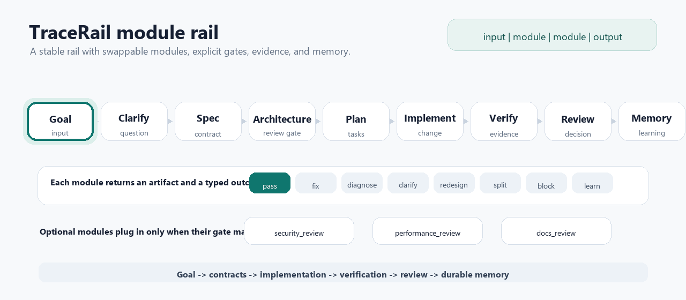

# TraceRail

TraceRail is a contract-first workflow kernel for AI-assisted software engineering.

It is not an agent runtime. It is the operating layer around agents: specs, architecture checks, memory, retrieval, verification, review, decomposition, and adapter governance. The goal is simple: help one agent work methodically, then make many agents safe to coordinate when the work is ready to scale.

## Why TraceRail Exists

AI coding tools are getting faster, but many projects still lose the thread:

- Requirements live in chat instead of specs.
- Architecture decisions are implied instead of recorded.
- Agents patch failures repeatedly instead of diagnosing root cause.
- Memory is scattered across transcripts, docs, issues, and local notes.
- Multi-agent work fans out before ownership, conflicts, and verification are clear.
- New tools are adopted because they are exciting, not because they solve a proven workflow gap.

TraceRail fills that gap with a portable, file-based system that keeps humans and agents aligned from goal to evidence to memory.

## Core Idea

Use one simple composition model with deeper protocols underneath.

```txt
rail = input | module | module | output
```

For normal software work:

```txt
goal | clarify | spec | architecture_review | task_plan | implement | verify | review | memory
```

Each module has a common interface: input, action, output, gate, and outcome. Each gate emits one outcome:

```txt
pass | fix | diagnose | clarify | redesign | split | block | learn
```

That small contract gives agents a shared language for moving forward, looping back, diagnosing failures, asking for help, or recording durable learning.

## How Modules Plug Into Rails

TraceRail core is meant to be a standard framework, not a fixed checklist. A rail is a workflow path. A module is a swappable stage with one common contract. IDEs and agents do not need to understand every possible module in advance; they follow the module contract, check the gate, emit an outcome, and preserve the artifact.

For example, an architecture review can be inserted into the feature rail without rewriting the whole workflow:

```txt
goal | clarify | spec | architecture_review | task_plan | implement | verify | review | memory
```

The same rail can accept other review gates when the project needs them:

```txt
goal | clarify | spec | security_review | architecture_review | task_plan | implement | performance_review | verify | review | memory
```



The animation shows the core shape: a stable rail advances through modules, optional review gates plug into the same contract, and every stage returns evidence plus a typed outcome.

To add a module:

1. Define its input, action, output, gate, outcome, artifacts, and adapter options.
2. Add it to a rail at the point where its gate should run.
3. Decide whether the main IDE agent runs it or a dedicated subagent owns it.
4. Require the module to return evidence and a typed outcome.
5. Preserve the result in the feature package, review, or memory.

That means a project can start with the simple feature rail and later insert stronger review gates, domain checks, or tool-backed adapters without changing TraceRail core.

## Quality Bar

TraceRail should look and behave like a serious framework repository even while it stays lightweight. The repository includes:

- Contribution, support, security, conduct, and changelog guidance.
- A documentation index and file architecture map.
- Repository standards for Markdown, validation, review, and release readiness.
- GitHub issue templates and a checker workflow.
- Editor, Git attributes, and ignore rules for consistent local work.

The standard is simple: every meaningful change should be easy to find, easy to review, easy to validate, and easy for the next human or agent to continue.

## What TraceRail Provides

- `AGENTS.md`: the AI entrypoint and operating contract.
- `CONTRIBUTING.md`, `SECURITY.md`, `SUPPORT.md`, `CODE_OF_CONDUCT.md`, `CHANGELOG.md`: public project governance.
- `docs/README.md`: documentation index.
- `docs/assets/`: README and documentation visual assets.
- `docs/ai/handbook.md`: the human and agent operating manual.
- `docs/specs/`: feature packages for meaningful work.
- `docs/framework/`: modular framework contracts and adapter governance.
- `docs/rails/`: reusable workflow rails.
- `docs/modules/`: composable module contracts, including `architecture-review`.
- `docs/packs/`: optional pack and community extension governance, including official packs.
- `docs/memory/`: durable memory, history, decisions, patterns, and retrieval pointers.
- `docs/research/`: dated ecosystem scans and practice decisions.
- `docs/milestones/`: version progress summaries.
- `scripts/check-template.ps1`: local structural validation.

## Quick Start

1. Read `AGENTS.md`.
2. Read `docs/ai/handbook.md`.
3. Create a feature package from `docs/specs/_template/`.
4. Fill the spec until acceptance criteria are testable.
5. Plan tasks with verification mapping.
6. Implement the smallest coherent slice.
7. Verify, review, and update memory.
8. Run the checker:

```powershell
powershell -NoProfile -ExecutionPolicy Bypass -File .\scripts\check-template.ps1
```

## When Work Gets Bigger

TraceRail scales by decomposition, not by sending many agents into the same fog.

Before fan-out, create a decomposition plan that defines:

- Shared goal.
- Work units.
- Dependencies.
- Conflict zones.
- Context bundles.
- Agent roles.
- Verification evidence.
- Handoff format.
- Stop conditions.
- Integration owner.

The rule is simple: ten agents need one shared goal, one decomposition plan, one integration owner, and ten bounded contracts.

For repeatable fan-out prep, use `docs/packs/official/tracepack-orchestration-readiness/`. It is an official pack, not a recommended pack yet, and stays dependency-free until real dogfooding proves a runtime adapter is worth evaluating.

## Tool Adapters

TraceRail can absorb ideas from tools like Superpowers, Astraeus, Spec Kit, BMAD, LangChain, LangGraph, AutoGen, CrewAI, Codex subagents, Serena, Repomix, Context7, Basic Memory, Mem0, Zep, Graphiti, and A-MEM.

The default is not to install them.

External tools enter through adapter evaluation:

```txt
research snapshot -> adapter evaluation -> practice register -> module registry -> handbook or template -> checker or review gate -> dogfood
```

This keeps the workflow modular without turning every project into a dependency stack.

## Repository Map

| Path | Purpose |
| --- | --- |
| `AGENTS.md` | Agent rules, routing, invariants, and tool policy. |
| `CONTRIBUTING.md` | Contribution workflow, validation, and extension standards. |
| `SECURITY.md` | Security reporting and permission guidance. |
| `SUPPORT.md` | Support entrypoints and boundaries. |
| `CODE_OF_CONDUCT.md` | Community behavior expectations. |
| `CHANGELOG.md` | Human-readable version history. |
| `docs/README.md` | Documentation index and navigation map. |
| `docs/assets/` | README and documentation visual assets. |
| `docs/ai/handbook.md` | Full workflow manual. |
| `docs/framework/README.md` | Modular framework overview. |
| `docs/framework/rail-composition.md` | Core pipe-like composition model for rails, modules, gates, and artifacts. |
| `docs/rails/` | Standard reusable rails such as feature, diagnosis, decomposition, adapter, and release. |
| `docs/modules/` | Core and adapter-inspired modules with one common interface. |
| `docs/packs/` | Optional pack lifecycle, template, conformance rules, and official pack index. |
| `docs/packs/official/tracepack-orchestration-readiness/` | First official pack for safe multi-agent fan-out preparation. |
| `docs/framework/module-registry.md` | Accepted modules and optional adapters. |
| `docs/framework/orchestration-patterns.md` | Pattern guide for single-agent and multi-agent work. |
| `docs/framework/capability-adapters.md` | Capability contracts inspired by external projects such as Superpowers and Astraeus. |
| `docs/specs/_template/` | Feature package template. |
| `docs/architecture/file-architecture.md` | Repository file architecture and ownership model. |
| `docs/quality/repository-standards.md` | Repository quality bar and review standards. |
| `docs/memory/` | Durable project memory and retrieval pointers. |
| `docs/research/practice-register.md` | Accepted, optional, watched, deferred, and rejected practices. |
| `docs/milestones/` | Version progress and approval summaries. |
| `scripts/check-template.ps1` | Local validation command. |
| `.github/ISSUE_TEMPLATE/` | Issue templates for bugs, features, and workflow improvements. |
| `.github/workflows/template-check.yml` | CI workflow for TraceRail structural validation. |

## Design Principles

- Professional repository surface with enforced quality artifacts.
- Rail composition as the core primitive.
- Simple surface, deep protocols.
- Spec first, implementation second.
- Source evidence before summaries.
- Diagnosis before repeated fixes.
- Single-agent excellence before multi-agent orchestration.
- Decomposition before fan-out.
- Adapters before dependencies.
- Verification before merge.
- Memory before moving on.

## Current Status

TraceRail is currently a file-based baseline. It is designed to be copied into projects, dogfooded, and extended through rails, modules, and optional packs before any runtime framework is installed. The first official pack is `tracepack-orchestration-readiness`, which packages safe multi-agent fan-out preparation without installing orchestration tooling.

The next frontier is proving the decomposition and orchestration templates on real agent-parallel work, then evaluating the first runtime adapter only after a repeated friction point appears.
