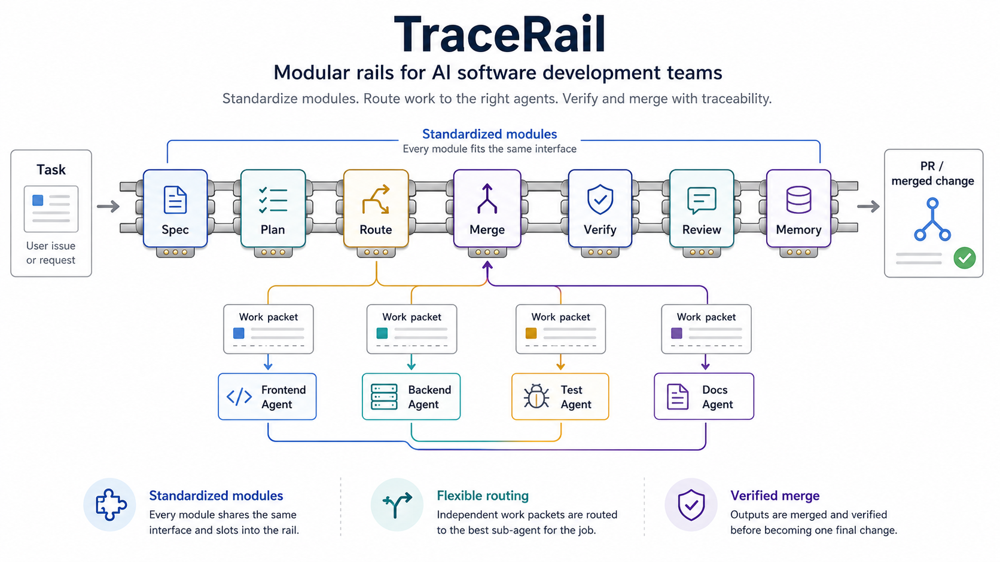

# TraceRail

[](https://github.com/GarrettAudet/TraceRail/actions/workflows/template-check.yml)

**Modular rails for AI software development teams.**

TraceRail gives teams a standard way to decompose tasks, route work to specialized agents, verify outputs, and merge changes with a full execution trace.



## How It Works

1. **Define the rail.** Compose reusable modules for the workflow your project needs.
2. **Decompose the task.** Turn the goal into a spec, plan, and bounded work packets.
3. **Route the work.** Send each packet to the best agent while preserving scope and dependencies.
4. **Merge and verify.** Integrate outputs, run gates, review the result, and require evidence before merge.
5. **Learn.** Record decisions, failed attempts, and durable lessons so the next run starts smarter.

```txt
task | spec | plan | route | merge | verify | review | memory
```

TraceRail is not an agent runtime. It is the operating layer that tells an IDE or agent what work to do, what artifact to return, and what evidence is required to continue.

## Core Contracts

| Contract | Purpose |
| --- | --- |
| Module | A reusable stage with a defined input, action, output, gate, and outcome. |
| Rail | An ordered composition of modules for a development workflow. |
| Work packet | A bounded task with scope, context, dependencies, verification, and stop conditions. |
| Gate | A decision point that passes, loops, diagnoses, splits, blocks, or records learning. |
| Execution trace | The linked record from goal and spec through implementation, evidence, review, and merge. |
| Memory | Durable project knowledge promoted from completed work. |

Rails stay simple because every module uses the same interface:

```txt
input | action | output | gate | outcome
```

## Start Here

1. Read [AGENTS.md](AGENTS.md) for the agent contract.
2. Read the [workflow handbook](docs/ai/handbook.md) for the operating model.
3. Copy [the feature package template](docs/specs/_template/) for meaningful work.
4. Define acceptance criteria, tasks, verification, and any safe parallel work packets.
5. Run the local check before review:

```powershell
powershell -NoProfile -ExecutionPolicy Bypass -File .\scripts\check-template.ps1
```

The core is file-based and dependency-free. External frameworks and agent runtimes connect through optional adapters and packs.

## Repository Guide

| Path | What it contains |
| --- | --- |
| [`AGENTS.md`](AGENTS.md) | Required agent instructions and workflow routing. |
| [`docs/ai/handbook.md`](docs/ai/handbook.md) | Human-readable operating manual. |
| [`docs/specs/`](docs/specs/) | Traceable feature work packages. |
| [`docs/framework/`](docs/framework/) | Rail composition, decomposition, orchestration, and adapter contracts. |
| [`docs/rails/`](docs/rails/) | Reusable workflow rails. |
| [`docs/modules/`](docs/modules/) | Standardized module contracts. |
| [`docs/packs/`](docs/packs/) | Optional first-party and community extensions. |
| [`docs/memory/`](docs/memory/) | Decisions, history, known issues, patterns, and retrieval pointers. |

## Principles

- Simple surface, explicit contracts.
- Clarify before ambiguous work.
- Decompose before parallelizing.
- Diagnose before repeated fixes.
- Verify before merge.
- Preserve evidence before summarizing.
- Update memory before moving on.

## Status

TraceRail is an early, file-based framework under active development. The current baseline supports disciplined single-agent work end to end and provides contracts for bounded multi-agent decomposition, routing, integration, and review. Runtime adapters remain optional until dogfooding proves they improve correctness or coordination.

See [Contributing](CONTRIBUTING.md), [Security](SECURITY.md), [Support](SUPPORT.md), and the [Changelog](CHANGELOG.md).
