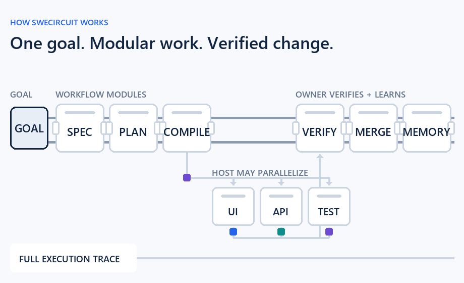

# IDECircuit

[](https://github.com/GarrettAudet/SWECircuit/actions/workflows/template-check.yml)

**The orchestration layer for agentic IDEs.**

IDECircuit turns one software goal into an architecture, bounded work units, task-specific
specialists, dependency-safe parallel work, verified integration, and a durable execution trace.



## Start Here

In Windows Codex Desktop, open this repository and send:

> Use IDECircuit to build [your goal] in [target repository path].

Keep this repository available as the operating workspace and make the target repository writable.
`AGENTS.md` drives the run. Activation is instruction-based in V14; there is no IDE plugin or
background service to install.

A developer or IDE closes the goal and decomposes it into atomic work units.
IDECircuit validates reviewed work units, compares legal specialist teams with a serial baseline, and emits exact contracts.

## How It Works

1. **Define:** clarify the goal, acceptance criteria, architecture, authority, and evidence.
2. **Compile:** create atomic work units and compare legal specialist teams with a serial baseline.
3. **Route:** choose the least-cost model, effort, skills, and tools that pass every hard gate in
   the host-supplied inventory.
4. **Run:** ask the IDE host to launch dependency-eligible specialists with maximum safe
   parallelism.
5. **Verify:** validate exact handoffs and dependency fan-in before one owner integrates the work.
6. **Learn:** preserve the trace, review the result, and promote durable lessons into memory.

IDECircuit compiles a least-cost feasible runtime assignment from reviewed host inventory; an external IDE host materializes the approved profile, model, effort, skills, and tools, then may run dependency-safe contracts in parallel.

IDECircuit Core compiles specialist contracts and verifies approval-bound packages, raw handoffs, dependency fan-in, and immutable run sessions.
An external IDE host dispatches agents, enforces permissions, executes tools, integrates and merges changes, persists traces, and updates memory.
RunView keeps that trust boundary visible.

## Verify

```powershell
npm ci
npm run build
node dist/cli.js validate --project examples/minimal
node dist/cli.js inspect --project examples/minimal --trace traces/example.jsonl
npm run example:specialist
npm run verify
```

The specialist example compiles and verifies a two-specialist package in memory. It writes no files and launches no agents.
The canonical gate covers formatting, lint, types, build, core and lifecycle tests, specialist compilation, V14 dogfoods, package contents, and an installed consumer.

V10's bounded injected-executor boundary remains available for one host-selected work packet:
[minimal example](examples/minimal/) | [executor contract](docs/framework/executor-boundary.md).

## Status

V14 is a Windows Codex Desktop release candidate, not a general release. Small, medium, and
high-risk dogfoods exercise native launch evidence, different runtime tiers, safe parallelism,
failed handoff recovery, verified fan-in, owner override gates, and tamper rejection. Release
requires the exact candidate to pass hosted Windows CI, independent audit, and owner-approved
merge.

V11 is the stable baseline. It compiles deterministic, approval-bound specialist packages and
verifies raw handoffs without executing agents. V12 adds the immutable run session used by V14.

IDECircuit is the public product identity. The current 0.x repository URL, npm workspace name,
schemas, and generated asset paths retain `SWECircuit` until a compatibility-reviewed migration.

[Agent contract](AGENTS.md) | [Handbook](docs/ai/handbook.md) | [Framework](docs/framework/) | [Feature specs](docs/specs/) | [Memory](docs/memory/)

[V14 milestone](docs/milestones/v14.md) | [Contributing](CONTRIBUTING.md) | [Security](SECURITY.md) | [Support](SUPPORT.md) | [Changelog](CHANGELOG.md)
